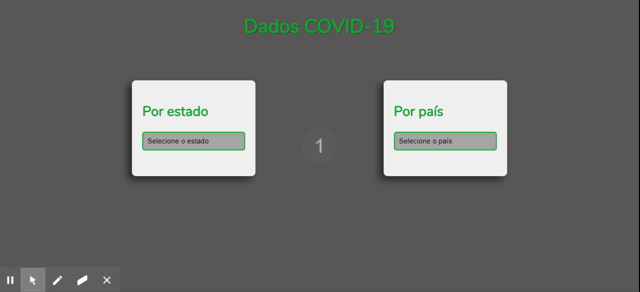

# Projeto de levantamendo de dados do Covid-19

> Aplicação simples que lista os dados atuais da situação do covid-19 no Brasil e no mundo. 
> Tecnologias: HTML, CSS, Javascript. Foi criado um arquivo json para listar somente os países que tem a contaminação,
este arquivo é chamado no script pela função fetch. 

## Author 
:woman_technologist: **ViviRamos**

[*LinkedIn*](https://linkedin.com/in/viviane-ramos-luz-346169187)
